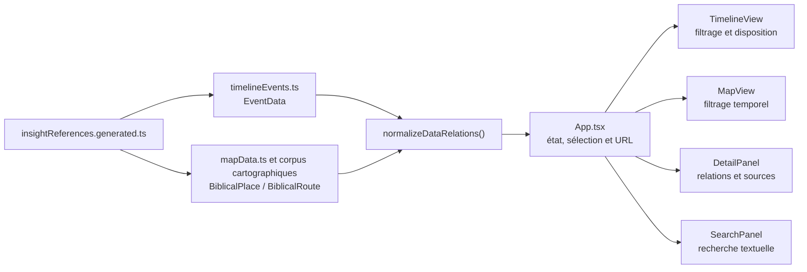

# Architecture des données historiques

## Statut et périmètre de cet audit

Ce document décrit l’architecture actuelle de l’Atlas biblique et propose une
migration progressive vers un modèle historique traçable. Il ne constitue pas
une migration de données.

À ce stade :

- aucune date, coordonnée, référence ou affirmation existante n’est modifiée ;
- aucune nouvelle donnée historique n’est ajoutée ;
- les interfaces actuelles restent la source de vérité de l’application ;
- les nouveaux types proposés ci-dessous ne doivent être introduits que par
  étapes, avec des adaptateurs de compatibilité et des validations automatiques.

L’objectif final est de pouvoir distinguer sans ambiguïté :

- une personne dont la vie recouvre une date ;
- une personne dont une activité est attestée à cette date ;
- une présence attestée ou seulement possible dans un lieu ;
- une contemporanéité calculée ;
- une interaction directement documentée ;
- l’origine exacte de chaque date, localisation et relation.

## Résumé de l’architecture actuelle

Le corpus est statique, versionné avec le code et consommé directement par les
composants React.



### Modèles centraux

`src/types.ts` fournit aujourd’hui :

- `EventData` pour tous les éléments de la frise, y compris les personnages ;
- `BiblicalPlace` pour les points cartographiques ;
- `BiblicalRoute` pour les itinéraires ;
- `BiblicalTerritory` pour les territoires ;
- `SourceReference` et `EncyclopediaReference` pour la documentation ;
- `EntityMetadata` pour les références, sources, notes et degré de certitude.

Les personnages ne sont pas des entités autonomes. Ils sont représentés par des
`EventData` appartenant à « Personnage » ou à des sous-catégories telles que les
rois, prophètes, règnes et filiations. La signification de `startYear` et
`endYear` dépend donc implicitement de la catégorie : durée de vie, règne,
ministère ou autre période d’activité.

### Identifiants et relations

Les entités récentes ont des identifiants explicites. Les données plus anciennes
peuvent recevoir un identifiant déterministe calculé à partir du libellé, de la
date et de la catégorie. Cet identifiant est reproductible, mais il change si
l’un de ces champs éditoriaux change ; il ne s’agit donc pas encore d’un
identifiant durable indépendant du contenu.

Les relations principales utilisent déjà des identifiants :

- `EventData.associatedLocationIds` ;
- `EventData.associatedRouteIds` ;
- `EventData.associatedCharacterIds` ;
- `BiblicalPlace.associatedEventIds` ;
- `BiblicalPlace.associatedCharacterIds` ;
- les relations équivalentes des itinéraires.

`src/utils/dataRelations.ts` conserve une compatibilité avec les anciens champs
textuels. Il tente de résoudre les noms normalisés en identifiants et construit
certaines relations inverses. Cette résolution est utile comme transition, mais
elle présente quatre fragilités :

1. les homonymes peuvent être ambigus ;
2. une correspondance non résolue peut être écartée sans rapport détaillé ;
3. la détection des personnages n’est pas identique dans tous les composants ;
4. une relation ne porte ni type, ni période, ni source, ni degré de certitude.

Pour les points d’itinéraire sans `placeId`, une correspondance par égalité
exacte des coordonnées est encore possible. Elle est trop fragile pour devenir
une convention pérenne.

### Dates

`src/utils/dateUtils.ts` transforme une date textuelle signée en :

- année de calendrier ;
- mois et jour ;
- position continue sur la frise.

La position interne compense déjà l’absence d’année zéro :

- 1 avant notre ère correspond à la position `-1` ;
- 1 de notre ère correspond à la position `0`.

Cependant, le type reste un simple `number` et le parseur accepte actuellement
la valeur `0`. Cette valeur entre en collision avec la représentation de
1 avant notre ère et peut être affichée comme une année historique inexistante.
Une valeur brute comportant l’année `0` existe dans l’entrée actuelle de Jean.
Elle doit être signalée et documentée avant toute correction ; cet audit ne
l’interprète pas et ne la modifie pas.

Les mois et jours sont limités à une plage exploitable lors du calcul de
position, mais une valeur brute invalide n’est pas rejetée comme telle. Le futur
validateur devra séparer normalisation d’affichage et validation du corpus.

Les booléens `fuzzyStart` et `fuzzyEnd` ne permettent pas de distinguer :

- une date approximative ;
- une date antérieure ou postérieure à une borne ;
- un intervalle de dates possibles ;
- une borne ouverte ;
- une date inconnue ;
- un jour artificiel utilisé uniquement pour placer l’élément dans l’année.

### Frise

`TimelineView` assure à la fois :

- la conversion entre temps et pixels ;
- le zoom et le déplacement ;
- la sélection du niveau sémantique ;
- la disposition des lignes ;
- le filtrage des éléments autour du viewport ;
- la construction visuelle des familles « événements » et « personnages » ;
- la transmission de la période visible à l’application.

Le filtrage visuel est effectué élément par élément avec une marge de rendu.
En revanche, il n’existe pas de service de requête historique indépendant. Une
question telle que « qui était actif à cette date ? » serait actuellement
confondue avec « quelle barre de personnage recouvre cette date ? ».

La détection des catégories de personnages repose sur la hiérarchie et les noms
de catégories dans la frise, tandis que la recherche ne reconnaît directement
que la catégorie exacte « Personnage ». Cette divergence peut classer un roi ou
un prophète comme un événement dans certains écrans.

Les limites chronologiques générales de la frise sont codées dans le composant.
Elles devront être dérivées d’une configuration ou du corpus validé avant un
enrichissement massif.

La période visible est ajoutée aux paramètres `from` et `to` de l’URL, mais ces
deux paramètres ne sont pas relus lors de l’initialisation actuelle. Le modèle
historique devra fournir un parseur commun et validé pour que les vues
chronologiques partagées puissent être restaurées sans confusion entre année de
calendrier et position de frise.

### Carte et filtrage temporel

`MapView` masque un lieu daté lorsque sa période ne croise pas la période visible
de la frise. Un lieu sans date reste toujours visible, ce qui est le comportement
attendu.

Ce filtrage porte toutefois sur la période du lieu lui-même, pas sur des
présences humaines. Il ne permet donc pas de déterminer qu’une personne se
trouvait dans un lieu à une date donnée. Il ne distingue pas non plus une ville,
un site archéologique, une région et un territoire au moyen d’une hiérarchie
géographique commune.

Le corpus affiché est actuellement centré sur les points d’intérêt. La liste
publique des itinéraires est vide et `BiblicalTerritory` n’a pas de corpus actif
consommé par l’interface. Les types doivent être conservés, mais leur réactivation
future nécessitera des géométries datées et sourcées.

Une seconde difficulté concerne les deux domaines numériques utilisés pour le
temps : la frise émet une position continue sans année zéro, alors que la carte
compare cette valeur aux années de calendrier des lieux. Cette différence peut
produire un décalage à la frontière entre avant et après notre ère. La conversion
doit être centralisée avant d’ajouter des requêtes temporelles.

### Panneau de détail

`DetailPanel` sait afficher un événement, un lieu ou un itinéraire, leurs
relations et leurs références. Il n’existe pas de fiche de personne distincte.

Les sources et le degré de certitude sont attachés à l’entité entière. Le
panneau ne peut pas exprimer, par exemple :

- que l’identité d’un lieu est probable mais ses coordonnées représentatives ;
- que la date d’une activité est calculée à partir de deux références ;
- qu’une présence est une inférence ;
- qu’une interaction est directement attestée ;
- que deux sources proposent des bornes différentes.

### Recherche

`SearchPanel` effectue une recherche textuelle dans les noms, descriptions,
catégories, noms alternatifs et références. Il ne dispose pas d’un index
historique permettant des requêtes par date, activité, présence ou relation.

La classification des personnages par comparaison exacte avec la catégorie
« Personnage » ne couvre pas toutes les sous-catégories de la frise. Cette règle
devra être remplacée par le type d’entité, et non par son libellé de catégorie.

### Sources et références

`SourceReference` contient un identifiant, un libellé, une URL et une citation
optionnelle. `EncyclopediaReference` sert surtout à naviguer vers l’article
correspondant et à conserver les variantes de noms.

La provenance cartographique est plus détaillée grâce à `coordinateSource`
(document, pixel, dimensions et méthode), mais ce mécanisme est spécialisé et
non réutilisable par les dates ou relations.

Le modèle actuel ne possède pas :

- de catalogue central des ouvrages et éditions ;
- de localisateur structuré par page, figure, paragraphe ou verset ;
- de rattachement d’une source à une affirmation précise ;
- de représentation des affirmations contradictoires ;
- de version de méthode pour les valeurs calculées ;
- de dépendances explicites entre une inférence et ses prémisses.

### Scripts de contrôle

Les contrôles existants couvrent principalement :

- TypeScript et le build de production ;
- la priorité et la provenance du corpus cartographique ;
- les liens JW Finder et WOL ;
- les références vers *Étude perspicace* ;
- les artefacts de la PWA.

Le workflow GitHub exécute actuellement TypeScript, le contrôle cartographique,
le build et le contrôle PWA. `pnpm check` ajoute le contrôle des liens JW, tandis
que le contrôle des références vers *Étude perspicace* reste une commande
séparée. La future CI historique devra rendre explicite le sous-ensemble
obligatoire au lieu de dépendre de plusieurs listes de commandes légèrement
différentes.

Ils constituent une bonne base, mais ne contrôlent pas encore :

- l’unicité globale et la stabilité des identifiants ;
- les relations orphelines ou ambiguës ;
- l’absence d’année zéro ;
- la validité des bornes temporelles ;
- la présence d’une preuve pour chaque affirmation ;
- l’intégrité d’un catalogue de sources ;
- la reproductibilité des relations calculées ;
- les résultats attendus de requêtes historiques de référence.

Il n’existe plus d’importateur XML dans l’application. Cela correspond à son
positionnement en lecture seule. Si un import de masse devient nécessaire pour
la maintenance du corpus, il devra rester un outil hors interface, exécuté à la
construction et bloqué par la validation.

## 1. Limites du modèle actuel

Les limites prioritaires sont les suivantes.

| Limite | Conséquence |
| --- | --- |
| Personne représentée comme `EventData` | Vie, règne, ministère et présence sont confondus |
| Dates sous forme de nombres et de deux booléens | Impossibilité d’exprimer précisément la nature d’une borne |
| Métadonnées au niveau de l’entité | Impossible de sourcer séparément un nom, une date, un lieu ou une relation |
| Relations sous forme de listes d’IDs | Absence de type, direction, temporalité et preuve |
| Identifiants dérivés du contenu | Un changement de libellé peut casser un lien |
| Catégories utilisées comme types métier | Résultats différents selon le composant |
| Logique historique dans les composants | Calculs difficiles à tester et à réutiliser |
| Temps de calendrier et position de frise mélangés | Risque de décalage autour du changement d’ère |
| Recherche uniquement textuelle | Pas de réponse fiable aux questions historiques |
| Sources non cataloguées | Dédoublonnage, éditions et localisateurs difficiles à contrôler |
| Itinéraires et territoires sans corpus actif | Pas de modèle validé pour les géométries historiques datées |

## 2. Concepts nécessaires

Les types ci-dessous sont des contrats cibles. Leur forme exacte peut évoluer
pendant la migration, mais leurs responsabilités doivent rester séparées.

### Identifiants durables

```ts
type HistoricalEntityId = string;
type HistoricalClaimId = string;
type SourceCatalogId = string;
```

Un identifiant canonique doit être attribué explicitement et ne jamais dépendre
du nom affiché, de la date ou de la catégorie. Les identifiants calculés actuels
restent acceptés dans une table d’alias pendant la transition.

### `TemporalBoundary`

Une borne temporelle représente ce que les sources permettent réellement
d’affirmer.

```ts
interface TemporalBoundary {
  kind:
    | 'exact'
    | 'circa'
    | 'before'
    | 'after'
    | 'between'
    | 'unknown';
  year?: HistoricalYear;
  earliestYear?: HistoricalYear;
  latestYear?: HistoricalYear;
  month?: number;
  day?: number;
  granularity: 'day' | 'month' | 'year' | 'period' | 'unknown';
  claimIds: HistoricalClaimId[];
}
```

`kind` décrit la précision temporelle. `certainty` décrit la confiance accordée
à l’affirmation : ces deux notions ne doivent pas être confondues.

### `TemporalSpan`

```ts
interface TemporalSpan {
  start: TemporalBoundary;
  end: TemporalBoundary;
  semantics:
    | 'instant'
    | 'lifespan'
    | 'activity'
    | 'reign'
    | 'ministry'
    | 'presence'
    | 'existence'
    | 'validity';
  inclusion: 'inclusive';
}
```

La sémantique rend explicite ce que la barre représente. Une borne inconnue
n’est pas remplacée par une date arbitraire.

### `HistoricalClaim`

`HistoricalClaim` est l’unité de provenance. Il relie un sujet, une propriété,
une valeur et les preuves qui justifient cette valeur.

```ts
interface HistoricalClaim<T = unknown> {
  id: HistoricalClaimId;
  subject: {
    entityType: 'person' | 'event' | 'place' | 'route' | 'territory';
    entityId: HistoricalEntityId;
  };
  predicate: string;
  value: T;
  origin: 'direct-source' | 'calculated' | 'inference';
  certainty: CertaintyLevel;
  evidence: ClaimEvidence[];
  dependencyClaimIds?: HistoricalClaimId[];
  rationale?: string;
  method?: {
    name: string;
    version: string;
  };
  status: 'active' | 'disputed' | 'superseded';
  lastVerified?: string;
}

interface ClaimEvidence {
  sourceId: SourceCatalogId;
  locator?: {
    page?: string;
    figure?: string;
    paragraph?: string;
    scripture?: string;
    gridReference?: string;
    urlFragment?: string;
  };
  note?: string;
}
```

Le prédicat devra provenir d’un vocabulaire contrôlé, par exemple
`person.birth-date`, `person.activity-span`, `person.present-at`,
`place.coordinate` ou `person.interacted-with`.

### `BiblicalPerson`

```ts
interface BiblicalPerson extends EntityMetadata {
  id: HistoricalEntityId;
  canonicalName: string;
  alternateNames?: string[];
  description?: string;
  lifespan?: TemporalSpan;
  activitySpanIds: string[];
  presenceEpisodeIds: string[];
  claimIds: HistoricalClaimId[];
}
```

Une personne devient une entité stable. Sa durée de vie, ses activités, ses
fonctions et ses déplacements sont des affirmations ou épisodes distincts. Le
nom affiché et la correspondance encyclopédique restent compatibles avec les
choix actuels.

### `PresenceEpisode`

```ts
interface PresenceEpisode {
  id: string;
  personId: HistoricalEntityId;
  placeId?: HistoricalEntityId;
  territoryId?: HistoricalEntityId;
  span: TemporalSpan;
  activityType?: string;
  claimIds: HistoricalClaimId[];
  certainty: CertaintyLevel;
}
```

Un épisode de présence ne doit pas être déduit d’une simple association entre un
personnage et un lieu. Il indique une localisation pendant une période précise,
avec sa preuve propre. Une présence dans une région peut être conservée sans
inventer une ville.

### Relation historique attestée

Les interactions directement documentées ont besoin d’une relation canonique
distincte des relations calculées.

```ts
interface AttestedHistoricalRelation {
  id: string;
  type:
    | 'interaction'
    | 'kinship'
    | 'succession'
    | 'travel'
    | 'participation'
    | 'other';
  subjectId: HistoricalEntityId;
  objectId: HistoricalEntityId;
  span?: TemporalSpan;
  placeId?: HistoricalEntityId;
  claimIds: HistoricalClaimId[];
}
```

Une relation de parenté, une participation au même événement et une rencontre
ne doivent jamais être assimilées automatiquement.

### `DerivedHistoricalRelation`

```ts
interface DerivedHistoricalRelation {
  id: string;
  type:
    | 'contemporary'
    | 'overlapping-activity'
    | 'possible-co-presence'
    | 'co-presence';
  subjectId: HistoricalEntityId;
  objectId: HistoricalEntityId;
  span?: TemporalSpan;
  placeId?: HistoricalEntityId;
  certainty: CertaintyLevel;
  inputClaimIds: HistoricalClaimId[];
  generatedBy: {
    algorithm: string;
    version: string;
    dataVersion: string;
  };
}
```

Cette relation est une projection recalculable. Elle ne doit pas être saisie
comme une vérité primaire ni utilisée comme preuve d’une interaction.

### `HistoricalSnapshot`

```ts
interface HistoricalSnapshot {
  at: HistoricalInstant;
  livingPersonIds: HistoricalEntityId[];
  activePersonIds: HistoricalEntityId[];
  presenceByPlace: Record<HistoricalEntityId, HistoricalEntityId[]>;
  eventIds: HistoricalEntityId[];
  uncertainties: SnapshotUncertainty[];
  generatedFrom: {
    dataVersion: string;
    algorithmVersion: string;
  };
}

interface HistoricalInstant {
  year: HistoricalYear;
  month?: number;
  day?: number;
}

interface SnapshotUncertainty {
  entityId: HistoricalEntityId;
  question: 'living' | 'active' | 'present';
  status: 'possible' | 'unknown';
  claimIds: HistoricalClaimId[];
}
```

Un instantané est le résultat d’une requête, pas une donnée historique primaire.
Il doit pouvoir exprimer trois états : confirmé, possible et inconnu. L’absence
de preuve de présence n’est pas une preuve d’absence.

### `SourceCatalogEntry`

```ts
interface SourceCatalogEntry {
  id: SourceCatalogId;
  type:
    | 'bible'
    | 'encyclopedia'
    | 'book'
    | 'article'
    | 'map'
    | 'dataset'
    | 'other';
  title: string;
  shortLabel: string;
  authors?: string[];
  publisher?: string;
  edition?: string;
  publicationYear?: number;
  language?: string;
  url?: string;
  documentId?: string;
  accessDate?: string;
  notes?: string;
}
```

Le catalogue décrit une publication une seule fois. La page, le verset, la
figure ou la grille restent attachés à `ClaimEvidence`, car ils varient d’une
affirmation à l’autre. Une référence encyclopédique de navigation peut continuer
à exister parallèlement : elle ne devient une preuve que si une affirmation la
cite explicitement.

## 3. Compatibilité temporaire avec les données existantes

La migration recommandée repose sur une couche canonique et des projections
compatibles.

1. Conserver `EventData`, `BiblicalPlace`, `BiblicalRoute` et les exports actuels
   tant que tous les consommateurs n’ont pas migré.
2. Ajouter les nouveaux modèles dans un module de domaine séparé plutôt que de
   surcharger immédiatement `src/types.ts`.
3. Créer un registre d’alias entre les anciens identifiants et les identifiants
   canoniques.
4. Générer une projection `EventData` depuis `BiblicalPerson` et ses périodes
   pour alimenter la frise inchangée.
5. Importer les anciennes relations textuelles par un adaptateur qui produit un
   rapport `résolu / ambigu / non résolu`, sans supprimer silencieusement les
   erreurs.
6. Transformer progressivement les métadonnées d’entité en
   `HistoricalClaim`. Les champs existants restent des résumés de compatibilité
   jusqu’à la migration de la fiche détaillée.
7. Maintenir des tests de parité garantissant que la projection produit les
   mêmes libellés, dates, catégories, coordonnées et relations visibles que le
   corpus actuel.

La stratégie doit être « nouvelle source canonique, ancienne vue projetée »,
et non deux copies éditables en parallèle. Tant que la bascule d’un domaine
n’est pas terminée, l’ancien fichier reste canonique pour ce domaine.

## 4. Ordre recommandé des migrations

### Phase 0 — Décisions et invariants

- décider la convention d’année et l’inclusion des intervalles ;
- définir la politique des identifiants ;
- définir les catégories de claims et de relations ;
- résoudre explicitement les ambiguïtés listées à la fin de ce document ;
- figer des sorties de référence du corpus actuel.

### Phase 1 — Fondations sans changement d’interface

- créer les types temporels, le catalogue de sources et les validateurs ;
- centraliser la conversion année historique ↔ position de frise ;
- interdire l’année zéro dans les nouvelles données ;
- faire seulement remonter les anomalies du corpus historique, sans correction
  automatique.

### Phase 2 — Identifiants et intégrité relationnelle

- attribuer des identifiants éditoriaux durables aux entités qui n’en ont pas ;
- ajouter le registre d’alias ;
- produire un rapport des relations textuelles ambiguës ou non résolues ;
- remplacer les correspondances par nom ou coordonnées par des IDs explicites.

### Phase 3 — Personnes autonomes

- créer `BiblicalPerson` ;
- classer chaque barre existante comme vie, activité, règne, ministère ou autre ;
- conserver la barre originale par projection vers `EventData` ;
- adapter la recherche et la fiche pour reconnaître le type `person`.

Cette phase ne doit pas déduire une naissance ou un décès à partir d’une simple
période de ministère.

### Phase 4 — Affirmations et sources

- créer `SourceCatalogEntry` et migrer les sources répétées ;
- représenter séparément les affirmations de nom, date, fonction, relation et
  localisation ;
- conserver les références d’entité actuelles comme vue agrégée ;
- permettre plusieurs affirmations concurrentes sans en choisir une
  silencieusement.

### Phase 5 — Présences et relations attestées

- introduire `PresenceEpisode` ;
- introduire les relations historiques typées ;
- exiger une source ou une justification pour chaque épisode et relation ;
- ne convertir les associations actuelles que lorsque leur sens est connu.

### Phase 6 — Calculs historiques

- créer le moteur de requête indépendant de React ;
- calculer contemporanéité, activité simultanée et co-présence ;
- produire `DerivedHistoricalRelation` avec ses entrées et sa version
  d’algorithme ;
- produire `HistoricalSnapshot` avec résultats confirmés, possibles et inconnus.

### Phase 7 — Migration des consommateurs

- alimenter la frise avec les projections du nouveau domaine ;
- filtrer la carte à partir des épisodes et claims pertinents ;
- enrichir le panneau de détail avec la provenance par affirmation ;
- indexer les personnes, activités, lieux, dates et relations dans la recherche ;
- conserver les URL et préférences existantes.

### Phase 8 — Retrait contrôlé du modèle hérité

- supprimer une projection uniquement lorsque plus aucun consommateur ne
  l’utilise ;
- garder les alias d’identifiants pour les anciens liens partageables ;
- archiver les rapports de migration et les jeux de résultats de référence.

## 5. Fichiers à créer ou modifier

La structure suivante limite le couplage avec l’interface.

### Fichiers à créer

| Fichier proposé | Responsabilité |
| --- | --- |
| `src/domain/history/types.ts` | Nouveaux concepts historiques |
| `src/domain/history/calendar.ts` | Années historiques, validation et conversion |
| `src/domain/history/predicates.ts` | Vocabulaire contrôlé des affirmations |
| `src/data/sourceCatalog.ts` | Catalogue central des sources |
| `src/data/biblicalPeople.ts` | Personnes canoniques |
| `src/data/historicalClaims.ts` | Affirmations atomiques |
| `src/data/presenceEpisodes.ts` | Présences temporelles et géographiques |
| `src/data/historicalRelations.ts` | Relations attestées |
| `src/data/idAliases.ts` | Correspondance anciens IDs ↔ IDs canoniques |
| `src/adapters/legacyTimelineAdapter.ts` | Projection vers `EventData` |
| `src/adapters/legacyRelationAdapter.ts` | Résolution contrôlée des anciennes relations |
| `src/services/historicalQuery.ts` | Requêtes temporelles et instantanés |
| `src/services/historicalDerivations.ts` | Relations calculées et traçabilité |
| `src/validation/historicalDataValidation.ts` | Validations réutilisables |
| `scripts/check-historical-data.mjs` | Contrôle bloquant pour CI |
| `src/domain/history/*.test.ts` | Tests temporels et relationnels |

Les noms exacts pourront être ajustés, mais le domaine, les données, les
adaptateurs, les requêtes et la validation doivent rester séparés.

### Fichiers à modifier progressivement

| Fichier | Évolution attendue |
| --- | --- |
| `src/types.ts` | Réexport temporaire, puis retrait des responsabilités historiques |
| `src/utils/dateUtils.ts` | Déléguer les conversions au calendrier central |
| `src/utils/stableIds.ts` | Réserver le hash aux alias hérités |
| `src/utils/dataRelations.ts` | Utiliser les types d’entités et produire un rapport |
| `src/data/timelineEvents.ts` | Devenir une projection après migration des personnes |
| `src/data/mapData.ts` | Consommer les IDs et claims géographiques canoniques |
| `src/App.tsx` | Consommer un dépôt de données et restaurer une période URL validée |
| `src/components/TimelineView.tsx` | Recevoir des projections, pas calculer le domaine |
| `src/components/MapView.tsx` | Filtrer à partir de périodes converties et d’épisodes |
| `src/components/DetailPanel.tsx` | Afficher preuves et statut par affirmation |
| `src/components/SearchPanel.tsx` | Rechercher par type d’entité et requêtes historiques |
| `package.json` | Ajouter les scripts de validation et de tests |
| `.github/workflows/ci.yml` | Exécuter les contrôles historiques |

## 6. Risques de régression

| Risque | Prévention |
| --- | --- |
| Changement d’un ID et rupture des URL | Registre d’alias permanent et test des anciennes URL |
| Décalage d’un an autour du changement d’ère | Un seul module de conversion et tests `-2, -1, +1, +2` |
| Réinterprétation d’une activité comme durée de vie | Sémantique obligatoire des périodes et revue humaine |
| Perte d’une relation textuelle | Rapport de migration bloquant sur les ambiguïtés |
| Modification involontaire d’une date ou coordonnée | Tests de parité champ par champ |
| Sources affichées mais non liées au bon fait | Validation des `claimIds` et localisateurs |
| Explosion combinatoire des contemporanéités | Calcul à la demande, index temporels et cache versionné |
| Présentation d’une inférence comme un fait | Statut d’origine visible et règles d’affichage communes |
| Confusion « même époque » / « rencontre » | Types de relations distincts et libellés non ambigus |
| Ralentissement de la frise et de la recherche | Projections indexées, mémoïsées et mesurées |
| Réactivation prématurée de routes ou territoires | Exiger géométrie, période et source validées |

## 7. Stratégie de validation

### Validation structurelle

Le contrôle de données devra échouer si :

- un ID canonique est dupliqué ;
- un alias pointe vers plusieurs entités ;
- une relation ou une preuve pointe vers un ID absent ;
- une source citée n’existe pas dans le catalogue ;
- une année vaut zéro ;
- un mois, un jour ou un intervalle est invalide ;
- une borne `between` ne possède pas ses deux limites ;
- une fin certaine précède un début certain ;
- un fait déclaré `direct-source` ne possède aucune preuve ;
- un calcul ne possède ni méthode versionnée ni claims d’entrée ;
- une inférence ne possède ni justification ni preuve ou prémisse ;
- une relation générée est enregistrée comme relation attestée.

### Tests calendaires

Les tests doivent couvrir au minimum :

- 2 avant notre ère → 1 avant notre ère → 1 de notre ère → 2 de notre ère ;
- l’aller-retour année historique ↔ position de frise ;
- les bornes ouvertes ;
- les intervalles inclusifs ;
- les dates approximatives et plages possibles ;
- le rejet explicite de zéro ;
- l’affichage français des deux ères.

### Tests de parité pendant la migration

Avant chaque bascule, comparer automatiquement l’ancien corpus et sa projection :

- nombre et identifiants d’éléments ;
- libellés et catégories ;
- dates brutes et positions visuelles ;
- coordonnées ;
- relations affichées ;
- références et liens externes ;
- résultats de recherche existants.

Quelques vues de référence de la frise, de la carte et des fiches doivent faire
l’objet de tests fonctionnels, notamment au changement d’ère et aux limites de
viewport.

### Jeux de requêtes historiques de référence

Créer un petit jeu de cas dont les réponses sont relues humainement :

- personnes certainement ou possiblement vivantes à une date ;
- personnes actives à cette date ;
- présences certaines ou possibles dans un lieu ;
- contemporains sans interaction connue ;
- interactions explicitement attestées ;
- claims et sources ayant conduit à chaque résultat.

Ces cas ne doivent être ajoutés qu’avec des données déjà validées. Ils deviennent
des tests de non-régression du moteur de requête.

### Intégration continue

La CI devrait exécuter, dans cet ordre :

1. validation du schéma historique ;
2. validation des IDs, sources et relations ;
3. tests calendaires et requêtes de référence ;
4. contrôles cartographiques et documentaires existants ;
5. contrôle TypeScript ;
6. build et contrôle PWA.

## 8. Statut épistémique des informations

La provenance et la certitude sont deux axes distincts.

| Statut | Définition | Exigences |
| --- | --- | --- |
| Fait directement sourcé | La source affirme directement la valeur ou la relation | Au moins une source et un localisateur précis |
| Fait calculé | Résultat déterministe obtenu à partir de claims existants | Claims d’entrée, algorithme et version |
| Inférence | Interprétation argumentée qui n’est pas formulée directement par la source | Prémisses, sources, justification et certitude |
| Relation générée automatiquement | Projection recalculable, par exemple un chevauchement | Type `DerivedHistoricalRelation`, entrées et version de données |

Règles d’usage :

- une source primaire ou documentaire ne rend pas automatiquement un fait
  « certain » ;
- un calcul exact peut dépendre de bornes incertaines et doit propager cette
  incertitude ;
- une inférence ne devient jamais un fait sourcé par simple validation
  technique ;
- une contemporanéité ne prouve ni rencontre, ni connaissance, ni influence ;
- une association d’entité actuelle ne devient pas automatiquement une présence ;
- les relations générées sont recréées, jamais corrigées manuellement ;
- l’interface doit afficher l’origine et le degré de certitude avec des libellés
  compréhensibles.

## 9. Convention pour les années

La convention canonique recommandée est une année historique signée sans zéro :

```ts
type HistoricalYear = number; // entier non nul, validé à l’exécution
```

| Valeur canonique | Affichage français |
| ---: | --- |
| `-2` | 2 av. n. è. |
| `-1` | 1 av. n. è. |
| `1` | 1 de n. è. |
| `2` | 2 de n. è. |

Règles :

- une valeur négative désigne une année avant notre ère ;
- une valeur positive désigne une année de notre ère ;
- `0` est invalide ;
- l’ère et la valeur absolue sont utilisées à l’affichage ;
- `Date`, les chaînes ISO et l’année astronomique ne doivent pas être utilisés
  directement comme modèle historique canonique ;
- les mois et jours optionnels sont stockés séparément avec leur granularité ;
- un champ inconnu reste `unknown`, jamais `0` ou une chaîne vide.

Pour les échanges éditoriaux, une forme explicite réduit encore les erreurs :

```ts
interface HistoricalYearInput {
  era: 'BCE' | 'CE';
  year: number; // entier strictement positif
}
```

Le signe n’est appliqué qu’après validation.

## 10. Absence d’année zéro

La frise a besoin d’un axe numérique continu, mais cet axe n’est pas une année
historique. Il faut donc introduire un type interne distinct :

```ts
type TimelineCoordinate = number;

function toTimelineCoordinate(year: HistoricalYear): TimelineCoordinate {
  assertHistoricalYear(year);
  return year < 0 ? year : year - 1;
}

function fromTimelineCoordinate(value: number): HistoricalYear {
  const year = value < 0 ? Math.floor(value) : Math.floor(value) + 1;
  return assertHistoricalYear(year);
}
```

Pour les positions fractionnaires, les fonctions de conversion doivent tenir
compte du mois et du jour et être testées séparément. Les composants ne doivent
jamais comparer directement une `TimelineCoordinate` à une `HistoricalYear`.

Mesures obligatoires :

1. valider les années à l’entrée du corpus ;
2. rejeter explicitement `0` dans les nouveaux fichiers ;
3. signaler les zéros hérités sans les corriger automatiquement ;
4. centraliser toutes les conversions dans `calendar.ts` ;
5. ne transmettre à la carte qu’une période de calendrier validée ;
6. ne formater que des `HistoricalYear` ;
7. ajouter des tests autour de la transition `-1` → `+1`.

## Sémantique des futures requêtes

Les réponses doivent conserver l’incertitude au lieu de forcer un booléen.

- **Vivant à une date** : le `lifespan` recouvre certainement ou possiblement la
  date. Une durée de ministère ne suffit pas à établir la vie entière.
- **Actif à une date** : au moins un épisode `activity` recouvre la date.
- **Présent dans un lieu** : un `PresenceEpisode` recouvre la date et cible ce
  lieu ou une zone géographique explicitement compatible.
- **Contemporain** : les durées de vie possibles se chevauchent. Cela n’implique
  aucune rencontre.
- **Activité simultanée** : deux périodes d’activité se chevauchent.
- **Co-présence** : deux épisodes de présence compatibles se chevauchent dans le
  même lieu et avec une granularité suffisante.
- **Interaction attestée** : une relation canonique possède un claim directement
  sourcé. Elle n’est jamais produite par le seul chevauchement.

Une API de requête devrait renvoyer `confirmed`, `possible` ou `unknown`, ainsi
que les `claimIds` qui expliquent le résultat.

## Décisions nécessaires avant la migration

Les points suivants ne peuvent pas être tranchés par le code sans risque de
modifier le sens historique.

1. **Valeur brute comportant l’année zéro pour Jean** : déterminer, source à
   l’appui, si elle désigne 1 avant notre ère, 1 de notre ère, une période
   traversant les deux ères ou seulement un artifice de placement.
2. **Sens des barres de personnages** : qualifier chaque catégorie et chaque
   exception comme durée de vie, règne, ministère, activité ou période inconnue.
3. **Intervalles** : confirmer que les bornes historiques sont inclusives et
   définir le traitement d’une date connue uniquement à l’année.
4. **Incertitude** : décider quand un résultat doit être « possible » ou
   « inconnu », en particulier avec une seule borne connue.
5. **Granularité géographique** : définir la compatibilité entre site, ville,
   région et territoire pour une requête de co-présence.
6. **Interactions** : établir le vocabulaire contrôlé et préciser ce qui compte
   comme rencontre, correspondance, parenté, succession ou participation.
7. **Conflits entre sources** : définir si une source est privilégiée par
   domaine, ou si plusieurs propositions sont affichées sans arbitrage.
8. **Politique des IDs** : choisir une convention lisible et durable, puis
   décider quels identifiants actuels deviennent canoniques ou seulement alias.
9. **Données héritées peu sourcées** : décider si elles restent visibles avec un
   statut « provenance à compléter » ou si leur migration est bloquante.
10. **Itinéraires et territoires** : confirmer qu’ils restent désactivés jusqu’à
    la disponibilité de géométries, périodes et sources suffisamment précises.

## Recommandation finale

La première implémentation ne devrait pas commencer par extraire les personnages
ni par ajouter des données. Elle devrait introduire le calendrier sans année
zéro, les identifiants canoniques, le catalogue de sources et le validateur, puis
figer des tests de parité du corpus actuel.

Une fois ces garde-fous en place, `BiblicalPerson` peut être introduit avec une
projection vers `EventData`. Les présences, claims, relations attestées et
relations calculées viennent ensuite. Ce séquencement permet d’enrichir
l’application sans casser la frise, la carte, les liens partageables ni les
références existantes, et surtout sans transformer implicitement une période
d’activité en biographie ou une contemporanéité en rencontre.
